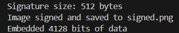
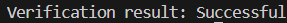
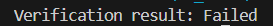

# Документація для підпису зображень за допомогою RSA і методів стеганографії LSB

## Огляд

Цей проект надає механізм цифрового підпису зображень за допомогою криптографії RSA та стеганографії на основі методу **Least Significant Bit (LSB)**. В основному, система дозволяє користувачам підписувати зображення, вбудовуючи цифровий підпис в найменш значущі біти пікселів зображення, зберігаючи таким чином цілісність зображення та підтверджуючи його автентичність.

### Потенційне застосування продукту:
- Забезпечення автентичності зображень.
  - Використання цифрових підписів дозволяє перевіряти автентичність зображень, що є важливим у багатьох сферах, зокрема для захисту інтелектуальної власності, журналістики, правозахисту, а також у судових справах для підтвердження цілісності доказів.
  - Система може використовуватися для забезпечення цілісності та незмінності медичних зображень, документів або інших візуальних доказів.

- Захисту від підробок або маніпуляцій з медіа.
  - У середовищі інтернету, де маніпуляції з медіа є серйозною проблемою, цей продукт може служити для захисту від фальсифікацій. Наприклад, у сфері цифрових медіа чи новин.
- Верифікації цілісності даних зображення, особливо в контексті медичних, юридичних або новинних зображень.

## Детальний опис підходу

- ### Метод Least Significant Bit (LSB)

Метод Least Significant Bit (LSB) є одним з найпоширеніших способів стеганографії, який дозволяє сховати інформацію в останніх бітах кожного пікселя зображення. У нашому випадку, найменші біти пікселів зображення використовуються для вбудовування цифрового підпису. Ось чому цей метод є ефективним:
- Незначні зміни: Зміни в останніх бітах пікселів майже не помітні для людського ока, що дозволяє приховувати підпис, не змінюючи зовнішній вигляд зображення.
- Простота та ресурсозатратність: LSB є простим для реалізації і не потребує великих обчислювальних ресурсів.

Однак, LSB також має свої обмеження:
- Вразливість до обробки: Якщо зображення буде піддано певним видам обробки, наприклад, стисненню або зміні розміру, стеганографія може бути порушена.
- Не для високої безпеки: Хоча цей метод досить ефективний для багатьох завдань, для використання в критично важливих додатках (наприклад, військовій чи фінансовій безпеці) потрібні інші, більш надійні методи.

- ### Як працює LSB
Кожен піксель зображення складається з трьох компонентів кольору (RGB): червоного, зеленого та синього. Кожен з цих компонентів представлений 8 бітами.

У методі LSB для кожного компонента кольору (червоного, зеленого і синього) змінюється тільки найменш значущий біт (***найправіший біт***).

Ці бітові зміни не змінюють візуально значення пікселя, оскільки зміни в останньому біті дуже малозначущі.

Таким чином, можна приховати декілька бітів (в нашому випадку, підпис) у кожному пікселі, при цьому не впливаючи на вигляд зображення.

- Приклад:
  - Піксель зі значенням (```255, 255, 255```) (білого кольору) у двійковому вигляді: (```11111111, 11111111, 11111111```).
  - Якщо ми хочемо зберегти біти 101 в LSB, то цей піксель стане: (```11111110, 11111111, 11111111```).

- ### RSA підпис

RSA використовується для створення цифрового підпису, оскільки це один з найпоширеніших та найнадійніших методів для забезпечення автентичності даних. Процес підписування зображення виглядає наступним чином:

1. Генерація підпису: 

   - Спочатку зображення хешується за допомогою алгоритму SHA256, щоб створити унікальний хеш для даного зображення.
   - Далі цей хеш підписується за допомогою RSA приватного ключа.

2. Додавання підпису до зображення:
   - Підпис вбудовується в зображення за допомогою методу LSB стеганографії, де кожен біт підпису вбудовується в найменш значущий біт кожного пікселя зображення.

3. Перевірка підпису:
   - Під час перевірки підпису із зображення витягується вбудований підпис.
   - Потім цей підпис перевіряється за допомогою RSA публічного ключа і порівнюється з хешем оригінального зображення.
   - Якщо підпис відповідає, це підтверджує, що зображення не було змінено після підписання.

## Процес підписування

**Імплементований у `signer_lsb.py`**

### 1. Генерація ключів RSA (одноразове налаштування)

```py
key = RSA.generate(4096)
with open("private_key.pem", "wb") as f:
    f.write(key.export_key('PEM'))
with open("public_key.pem", "wb") as f:
    f.write(key.publickey().export_key('PEM'))
```

або (версія через `openssl`)

```bash
# Генерація приватного ключа
openssl genpkey -algorithm RSA -out private_key.pem -pkeyopt rsa_keygen_bits:4096

# Отримання публічного ключа
openssl rsa -pubout -in private_key.pem -out public_key.pem
```

В результаті буде згенеровано пару ключів RSA довжиною 4096 біт. Приватний ключ у файлі `private_key.pem`, а відкритий ключ - у файлі `public_key.pem`.

### 2. Підпис зображення

Ви можете підписати зображення, викликавши функцію sign_image():

```py
sign_image("original.png", "private_key.pem", "signed.png")
```

- Параметри
  
  - `original.png`: Шлях до оригінальної картинки

  - `private_key.pem`: Шлях до приватного ключа
  
  - `signed.png`: Кінцева назва підписаної картинки


- Workflow:
  - Завантажує зображення з вказаного шляху до файлу (`original.png`).
  - Зчитує приватний ключ з файлу (`private_key.pem`).
  - Хешує зображення за допомогою **SHA-256**.
  - Підписує хеш закритим ключем **RSA**.
  - Приховує отриманий цифровий підпис всередині зображення, використовуючи **LSB**.
  - Зберігає зображення з прихованим підписом у вказаний вихідний файл (`signed.png`).


### 3. Примітка: Розмір підпису
Розмір підпису RSA залежить від розміру використовуваного ключа RSA. Для 4096-бітового ключа розмір підпису буде приблизно 512 байт. Цей розмір важливий, оскільки загальна кількість бітів у підписі (плюс інформація про довжину) повинна вміститися в межах доступних пікселів зображення.

Підпис вбудовується у зображення разом з 32-бітним двійковим значенням довжини на початку. Це дозволяє процесу верифікації знати, скільки біт даних потрібно витягти із зображення.

### 4. Приклад використання

Задавши зображення original.png, після запуску скрипта ви отримаєте нове зображення signed.png з прихованим цифровим підписом.

Щоб запустити скрипт, виконайте:

```bash
python signer_lsb.py
```

Приклад виводу:



Якщо зображення занадто мале, щоб вмістити підпис (тобто, якщо у ньому недостатньо пікселів для зберігання всіх бітів підпису), програма видасть помилку ValueError:

```vbnet
ValueError: Image too small to store the signature
```

## Процес перевірки підпису

**Імплементований у `verifier_lsb.py`**

### 1. Перевірка підпису
`extract_signature(image_path)` \
Ця функція витягує прихований цифровий підпис із заданого зображення. Передбачається, що зображення було підписано раніше і підпис вбудовано з використанням методу найменшого значущого біта (LSB).

- Параметри:
image_path: Шлях до файлу зображення, з якого потрібно витягти підпис.

- Повертається:
Байтовий об'єкт, що містить витягнутий цифровий підпис.

- Workflow:
  - Завантажує зображення і перетворіть його в масив.
  - Вирівнює масив зображень, щоб полегшити доступ до окремих пікселів.
  - Витягує 32-бітову довжину підпису (приховану в перших 32 бітах зображення).
  - Витягує біти підпису з зображення, починаючи з 33-го біта.
  - Перетворює витягнутий двійковий підпис назад у байтовий масив і повертає його.

### 2. Порівняння підпису
`verify_image(image_path, signed_image_path, public_key_path)` \
Ця функція перевіряє цілісність підписаного зображення, порівнюючи його підпис з відкритим ключем RSA. Вона перевіряє відповідність підпису хешу зображення.

- Параметри:
  - `image_path`: Шлях до файлу оригінального зображення.
  - `signed_image_path`: Шлях до файлу підписаного зображення, з якого буде вилучено підпис.
  - `public_key_path`: Шлях до файлу з відкритим ключем RSA, який використовується для перевірки підпису.

- Повертається:
  - `True`, якщо підпис дійсний і зображення не змінено.
  - `False`, якщо підпис недійсний або зображення було підроблено.

- Workflow:
  - Завантажує відкритий ключ RSA з вказаного шляху до файлу.
  - Витягує підпис з підписаного зображення за допомогою функції extract_signature().
  - Завантажує оригінальне зображення і обчисліть його хеш SHA-256.
  - Використовує відкритий ключ RSA для перевірки підпису на відповідність хешу оригінального зображення.
  - Повертає `True`, якщо підпис дійсний, інакше - `False`.


### 3. Виконавчий блок коду
Скрипт викликає функцію `verify_image()` для перевірки автентичності підписаного зображення і, якщо перевірка пройшла успішно, відкриває зображення за допомогою стандартного засобу перегляду зображень.

```py
if __name__ == "__main__":
    # Verify the image and open it if verification is successful
    result = verify_image("original.png", "signed.png", "public_key.pem")
    if result:
        print("Verification result: Successful")
        os.startfile("signed.png")  # This will open the image using the default Windows application
    else:
        print("Verification result: Failed")
```
### 4. Приклад використання
Щоб перевірити цілісність підписаного зображення, ви можете запустити скрипт наступним чином:

```bash
python verifier_lsb.py
```

Приклад виводу:



Неуспішний:




### 5. Примітки

- Перевірка: Зображення вважається дійсним, якщо витягнутий підпис збігається з обчисленим хешем оригінального зображення і пройшов процес перевірки підпису RSA.

- Обробка помилок: Відбувається перехоплення ValueError і TypeError під час процесу перевірки підпису. Якщо ловимо помилку, функція повертає False.

- Цілісність зображення: Якщо зображення було підроблено або змінено після того, як його було підписано, перевірка не буде успішною, що гарантує автентичність зображення.

- Міркування безпеки
  - Ключ RSA, який використовується для перевірки, повинен бути захищений
  - Модифікація зображення: Будь-яка модифікація зображення, навіть незначна (наприклад, зміна одного пікселя), призведе до невдалої перевірки підпису.

## Вимоги
- Python 3.x
- Бібліотеки:
  - `pycryptodome`: для роботи з RSA, SHA256 і підписами.
  - `Pillow`: для роботи з зображеннями.
  - `numpy`: для обробки масивів зображень.
  - Опціональний: `opensssl` для створення ключів

```bash
pip install pycryptodome pillow numpy
choco install openssl
```

## Джерела
LSB Steganography — Hiding a message in the pixels of an image: [medium.com](https://medium.com/@renantkn/lsb-steganography-hiding-a-message-in-the-pixels-of-an-image-4722a8567046)

Steganography via codes for memory with defective cells: [research.gate](https://www.researchgate.net/publication/228565389_Steganography_via_codes_for_memory_with_defective_cells)